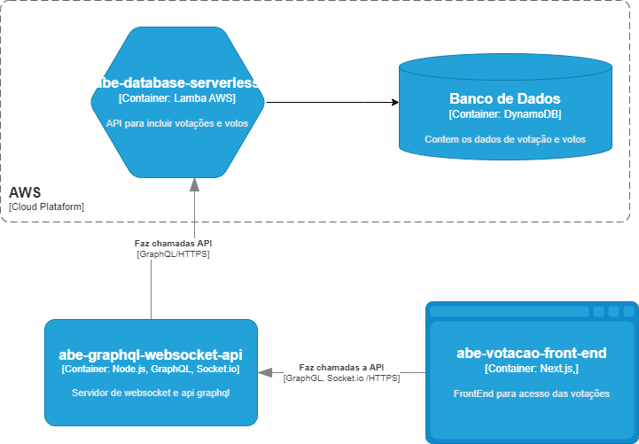

# Documentação para a solução de criação de enquetes

Trabalho prático da disciplina de Arquitetura de BackEnd - Pós-Graduação em Arquitetura de Soluções da **PUC Minas**

Nome dos integrantes do grupo:

- Leandro Moreira da Silva
- Leon Wagner Farias de Souza
- Jonas Lima de Amorim
- Junia Almeida Matos Boechat
- Samara Luiza da Silva

## Solução de enquetes e votação online

A solução é composta por quatro componentes

- Banco de dados (DynamoDB)
- API node serverless abe-database-serveless -  [Documentação - Polls](/doc-swagger-api-serverless/docs/PollsApi.md) e [Documentação - Votos](/doc-swagger-api-serverless/docs/VotesApi.md) - Veja também [Acesso Swagger](https://app.swaggerhub.com/apis/Alpatech-SL/abe-database-serverless/1.0.0)
- API graphQL e Websocket - [Documentação](/doc-graphql/schema/index.html)
- Página de acesso - abe-votacao-front-end [Link de acesso](https://abe-votacao-front-end.vercel.app)

A solução criada permite a listagem de enquetes, a criação de novas enquetes e a votação de forma automática.

Links de acesso para os repositórios

- [abe-database-serverless](https://github.com/jonas1307/abe-database-serverless/)
- [abe-graphql-websocket-api](https://github.com/jonas1307/abe-graphql-websocket-api)
- [abe-votacao-front-end](https://github.com/jonas1307/abe-votacao-front-end)

O componente `abe-graphql-websocket-api` implementa GraphQL para disponibilizar para `abe-votacao-front-end` a api `abe-database-serverless` e também implementa um servidor socket para transmitir os votos em tempo real.

